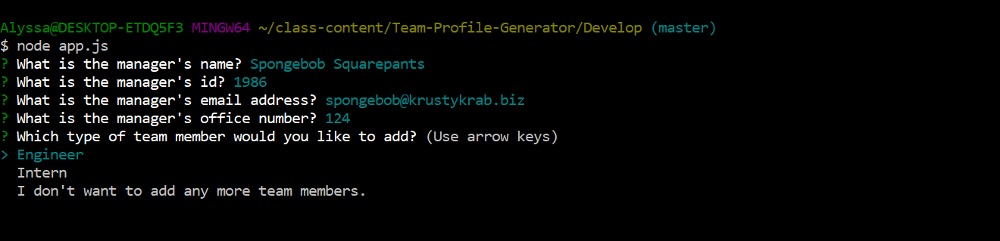
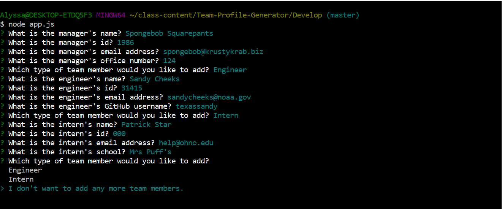
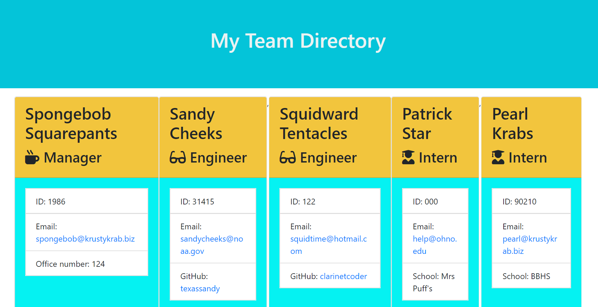

# TEAM PROFILE GENERATOR  

## Description  
This is a command-line application that dynamically generates a webpage that displays information about a team of employees based on user input.

## Table of Contents

* [Technologies Used](#technologies-used)

* [Libraries Used](#libraries-used)

* [Dependencies](#dependencies)

* [How to Use](#how-to-use)

* [Demonstration Video](#demonstration-video)

* [How I Made This](#how-i-made-this)

* [Tests](#tests)

* [GitHub Repo](#link-to-github-repo)

* [Future Development Ideas](#future-development-ideas)

## Technologies Used  
Built in Visual Studio with      
HTML  
CSS  
Javascript    
Node.js     

## Libraries Used
Bootstrap  
Font Awesome  

## Dependencies  
Inquirer     
fs    

## How to Use  
Install Inquirer using npm install.  

Run the program by typing "node app.js" in the command line.  
   

A series of questions will appear, one by one, asking for information about the team manager. These questions are:     
  --What is the manager's name?  
  --What is the manager's id?   
  --What is the manager's email address?  
  --What is the manager's office number?
  

Next, the user will be asked if they would like to add another member to the team profile and will be given a choice of adding an engineer, an intern, or not adding anyone new. If the user chooses to add an engineer, then they will be prompted with the following questions:    
  --What is the engineer's name?  
  --What is the engineer's id?  
  --What is the engineer's email address?    
  --What is the engineer's GitHub username?  

If the user chooses to add an intern, they will be prompted to answer the following questions:  
  --What is the intern's name?    
  --What is the intern's id?    
  --What is the intern's email address?    
  --What is the intern's school?    

The user may add as many new members to their team as they would like. When they finish and choose, "I don't want to add any more team members," an html file called team.html will be added to their output folder.   

Once opened, the user can see their styled, well organized team profile page complete with a card for each employee that includes all of the provided information as well as an icon that corresponds with each role.
 

## Demonstration Video
(https://drive.google.com/file/d/18x1tXYO_kJeNDa8-VRgbrhDG_5-In7ap/view)

## How I Made This  
I was given some starter code for this project: html templates, htmlRenderer.js, the first few lines of app.js, plus all of the tests. 

The first thing I did was install jest and inquirer. Then I ran the tests to see what was missing. That helped me to create the Employee class and then the Manager, Intern, and Engineer classes, which extended the Employee class. I continued to run those tests until they all passed.

At that point I finished the app.js code, first laying out all of the functions that included inquirer prompts for each employee role and then pushed each employee's data into an array called "team". These functions also handled the logic of which questions come next and what happens if the user is finished adding team members to their list. 

The html renderer code did a lot of the work for me in terms of getting the information from the team array to the produced "team.html" file via the templates. 

Finally, I styled it out a little bit using CSS. 

## Tests
Tested with Jest. If interested, install Jest and type "run npm test" in the command line to test.

## Link to GitHub Repo    
(https://github.com/alyssahellrung/Team-Profile-Generator)

## Future Development Ideas
I need to clean up the styling a little bit in terms of making the cards consistent in size without compromising the readability of the infomation on the cards.
I would really like for there to be a way to add company logos in the jumbotron and to allow the user to pick which colors the page ends up being.

